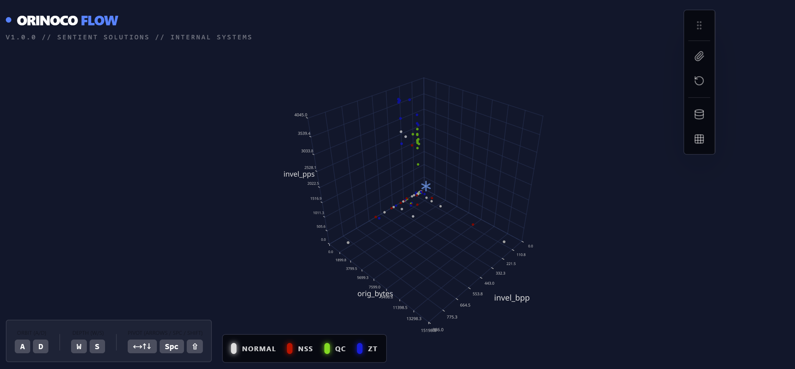
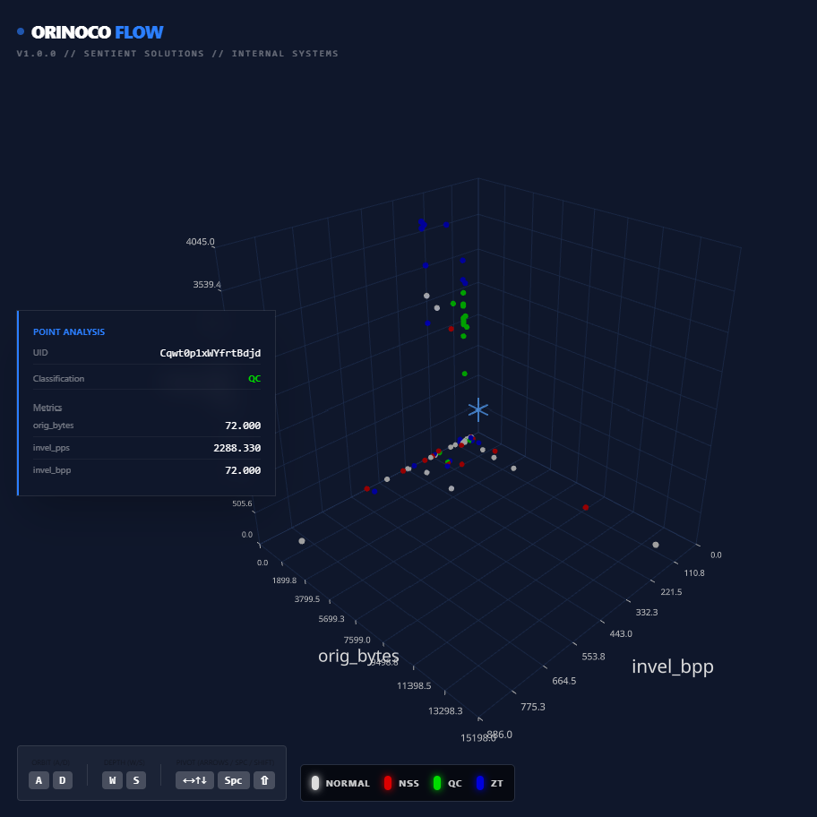
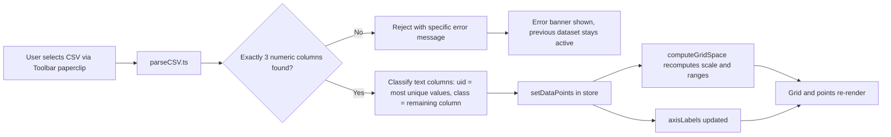
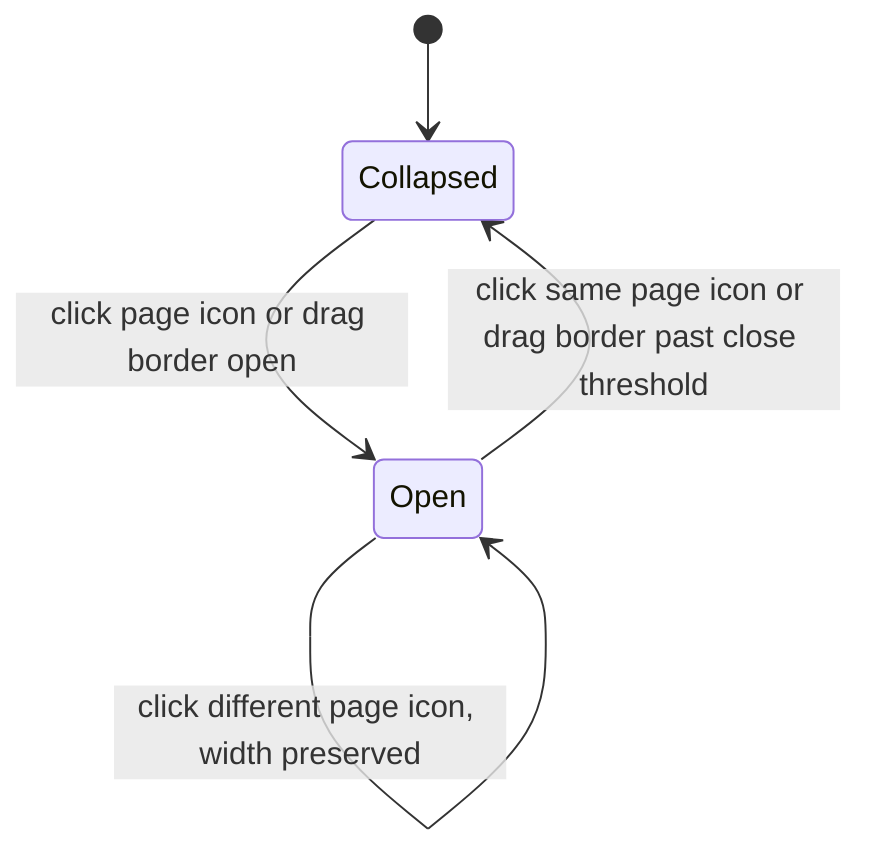
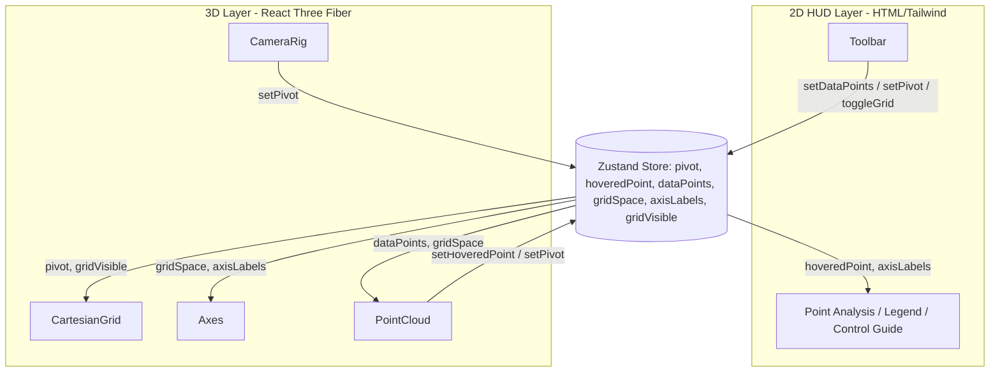

# Project Orinoco // 3D Cyber Threat Intelligence Visualizer

Project Orinoco is a browser-native 3D visualization tool for exploring network telemetry. It projects selected traffic features into a three-dimensional Cartesian space, allowing analysts to inspect individual observations, navigate spatial relationships, and investigate clusters interactively.

The application visualizes network flow features within a 3D Cartesian coordinate system. Analysts can navigate the environment, inspect individual data points, and dynamically adjust their exploration viewpoint through an interactive pivot system. Camera movement is always relative to the active pivot. Analysts are no longer limited to the bundled sample dataset — any CSV matching the expected shape (three numeric columns, one or two text columns) can be loaded directly in-browser.

---

# Preview

## Application Demo

**Demo Videos:**
[Watch Orinoco MVP Walkthrough 7/8/2026](https://youtu.be/Gr2Yjx_JF_4)
[Watch Orinoco MVP Walkthrough 7/20/2026](https://youtu.be/_KvzO14yMGE)

Example walkthrough:

- Navigate the 3D environment using keyboard and mouse controls
- Hover over threat nodes to inspect metadata
- Select nodes to change the active pivot location
- Explore surrounding data points from different perspectives
- Load a new CSV dataset directly from the toolbar, with the grid, axis labels, and points all updating to match

---

## Screenshots

### Main Visualization View



### Point Inspection HUD



---

# Key Features

## 3D Cartesian Plot Visualization

Project Orinoco renders high-dimensional network features in an interactive WebGL environment using Three.js and React Three Fiber.

The plotting volume is an open-face Cartesian box, built in `CartesianGrid.tsx`. Tick marks, numeric labels, and axis titles are rendered separately in `Axes.tsx`. Each axis is independently scaled to the dataset's numeric range, rather than assuming a fixed bound — tick labels always reflect real data-space values, and recompute automatically whenever a new dataset is loaded.

Data dimensions (bundled sample dataset):

| Feature    | Axis |
| ---------- | ---- |
| invel_pps  | Y    |
| orig_bytes | X    |
| invel_bpp  | Z    |

A loaded CSV's own column names replace these automatically — see **Dynamic Dataset Loading** below.

---

## Dynamic Dataset Loading

Analysts can load any CSV dataset directly in-browser via the toolbar's file picker, rather than being limited to the bundled sample. The parser (`src/lib/parseCSV.ts`) auto-detects columns instead of assuming fixed names:

1. Each column is classified as **numeric** or **text** by sampling its values
2. The three numeric columns are mapped to X/Y/Z, in the order they appear in the file's header row
3. Text columns are mapped to a unique identifier (`uid`) and a classification label (`class`) — the column with the highest ratio of unique values is treated as the identifier
4. Malformed files (wrong number of numeric columns, no text columns, empty file) fail with a specific, visible error message rather than silently producing bad output or crashing

Once a file loads successfully, the grid's scale, the axis labels, the Point Analysis HUD panel's metric labels, and the rendered points all update together — nothing in the visualization stays hardcoded to the original sample dataset.



**Known limitations (accepted for the current release):**

- Column order in the source file determines which numeric column becomes X, Y, or Z — there is no manual override UI yet
- Only the first two text columns are used (identifier and classification); additional text columns are currently ignored

---

## Tactical Navigation

The visualization environment supports analyst-focused navigation.

| Input         | Action                               |
| ------------- | ------------------------------------ |
| W             | Move toward current pivot            |
| S             | Move away from current pivot         |
| A             | Orbit left around pivot              |
| D             | Orbit right around pivot             |
| Left / Right  | Move pivot along the X axis          |
| Up / Down     | Move pivot along the Z axis          |
| Space / Shift | Raise / lower pivot along the Y axis |
| Mouse Drag    | Free camera rotation                 |
| Mouse Hover   | Inspect point metadata               |
| Mouse Click   | Set selected node as new pivot       |
| Toolbar Reset | Return pivot to origin               |

---

## Dynamic Pivot System

Users can select any data node as an investigation reference point, or move the pivot directly with the arrow/space/shift keys.

When the pivot changes:

1. The global pivot coordinate updates in the shared store
2. The camera translates by the same offset that the pivot moved — rotation is preserved, so the new pivot lands at the same screen position the old one held rather than the camera whipping around to face it
3. The tactical reticle (a six-armed cross) tracks the new position
4. Analysts can explore nearby data relationships from the new vantage point

**Lockstep marker tracking:** the pivot marker is driven imperatively by `CameraRig.tsx`, in the same per-frame update as the camera itself, rather than being bound to React state. A state-driven marker lagged a frame behind the camera's own imperative movement, since store updates commit asynchronously relative to the render-frame loop — the imperative approach eliminates that lag entirely.

Users can reset the investigation pivot to the origin coordinate through the toolbar's reset control, providing a consistent baseline for spatial exploration.

---

## Interactive Point Inspection

Interactive 3D events provide metadata inspection through the Heads-Up Display (HUD).

Displayed information includes:

- UID
- Classification
- XYZ coordinates
- Feature values, labeled with the active dataset's real column names

---

## SOC-Inspired Interface

The interface uses a security operations center inspired design with high-contrast visualization and a glass-morphism HUD.

Current classification visualization (bundled sample dataset):

| Data Value | Color     |
| ---------- | --------- |
| `normal`   | `#dddddd` |
| `nss`      | `#dd0000` |
| `qc`       | `#00dd00` |
| `zt`       | `#0000dd` |

A loaded CSV's own class values inherit these colors where names match, and fall back to a default color for any unrecognized class.

---

## Toolbar

A Blender-style docked side panel provides quick access to data and display controls, without needing to memorize keyboard shortcuts for everything.

**Layout:** an icon strip sits fixed between the 3D viewport and a resizable content pane, both docked to the screen's right edge. Dragging the border on the icon strip's viewport-facing side resizes the content pane open or shut — matching the interaction pattern of Blender's Properties editor.

**Icon strip contents:**

| Icon          | Action                                                                                                     |
| ------------- | ---------------------------------------------------------------------------------------------------------- |
| Paperclip     | Opens the native file picker to load a CSV                                                                 |
| Reset         | Returns the pivot to the origin                                                                            |
| Eye / Eye-off | Toggles the Cartesian grid box on or off (axis labels remain visible either way)                           |
| Data          | Opens a panel reserved for dataset filtering and point-size scaling (in progress, tracked separately)      |
| Grid          | Opens a panel reserved for alternate grid layouts and axis-scaling modes (in progress, tracked separately) |



---

# Architecture

Project Orinoco separates rendering, application state, and interface responsibilities.

## Design Philosophy

Project Orinoco follows a separation-of-concerns architecture:

- React manages application structure and UI
- React Three Fiber manages 3D visualization
- Zustand manages shared interaction state, including the active dataset
- Data sources remain independent from rendering logic — any dataset matching the expected shape can be loaded without touching rendering components

This architecture allows the visualization engine to evolve as new threat datasets become available.



### Two-layer rendering model

The application renders two separate layers stacked on top of each other: a flat 2D HTML/Tailwind layer (branding, HUD panels, legends, the toolbar) and a 3D `<Canvas>` layer beneath it (the navigable scene). These are two independent React trees — the HTML layer isn't a child of the Canvas, and neither has a direct reference to the other.

The 2D layer uses `pointer-events-none` so mouse clicks pass through it into the 3D scene, except where a specific HUD element (like the toolbar) opts back in. Because the two trees can't pass props to each other directly, they communicate exclusively through the shared Zustand store: a pointer event inside the Canvas (e.g. hovering a data point in `PointCloud.tsx`) updates the store, and the HTML layer (in `App.tsx`) reacts to that same store value to update the HUD — with neither component needing to know the other exists.

**Note on the toolbar's z-index:** React Three Fiber's `<Canvas>` wrapper renders after the HUD overlay in the DOM and establishes its own stacking context. Without an explicit `z-index` on the toolbar, the Canvas visually paints on top of it despite looking identical to the background — silently intercepting clicks meant for the toolbar. The toolbar is deliberately given a higher `z-index` than the HUD overlay to prevent this.

### Why Zustand for shared state

Given the two-layer model above, some mechanism is needed to synchronize state between the 3D scene and the 2D HUD. Zustand was chosen over React Context or Redux for a few reasons:

- No `<Provider>` wrapper required — any component calls the `useStore` hook directly
- Components subscribe to only the specific state slice they need (e.g. `state => state.pivot`), so a change to one field doesn't cause unrelated components to re-render
- Minimal boilerplate compared to Redux's actions/reducers/dispatch pattern, appropriate for the amount of shared state this application needs

**Exception to the store-driven pattern:** the pivot cross marker is driven imperatively by `CameraRig.tsx` via a ref, not by reading `pivot` from the store — see **Dynamic Pivot System** above for why.

### Why a custom Cartesian grid instead of a built-in helper

`@react-three/drei` ships a generic `Grid` helper — a flat, infinite floor-plane grid intended for general 3D scene reference (e.g. a game editor's floor). It doesn't support bounded dimensions, selectable wall faces, or tick marks/axis labels tied to specific data ranges.

The spec calls for a box with visible walls on specific sides only (an "open-face" box, per analyst feedback that a fully enclosed cube obscures the view), plus numbered ticks synced to axis name labels. No configuration of the drei helper could produce this — so `CartesianGrid.tsx` and `Axes.tsx` were built as custom components instead, giving full control over bounds, open/closed faces, and tick/label placement.

### Dynamic per-axis scaling

Each axis scales independently based on the currently active dataset's actual range, computed by `computeGridSpace()` in `src/lib/gridSpace.ts`. This was originally a set of constants computed once at load time from the bundled `data.json`; it's now a pure function, re-run every time a new dataset is loaded, so the grid box, tick labels, and point positions all stay correct regardless of which dataset — bundled or loaded via CSV — is currently active.

Independent per-axis scaling (rather than one shared scale) exists because the real dataset's three columns (byte counts, packet rates, bytes-per-packet) live on wildly different magnitudes — a single shared scale factor compressed two of the three axes into a nearly flat sliver. `gridSpace.ts`'s output is the single source of truth for these bounds, shared by `CartesianGrid.tsx` (box geometry), `Axes.tsx` (ticks/labels), and `PointCloud.tsx` (point positioning), so the three can never drift out of sync with each other.

---

## Application Structure

```text
orinoco/
├── docs/
│   ├── images/
│   │   ├── main.png
│   │   └── data_info.png
│   └── video/
│       └── orinoco-demo.mp4
│
├── test-data/
│   ├── test-1k.csv
│   │   └── Synthetic 1,000-row dataset for load/render testing
│   ├── test-10k.csv
│   │   └── Synthetic 10,000-row dataset for performance testing
│   └── test-malformed.csv
│       └── Deliberately invalid CSV (wrong column count) for
│           exercising parseCSV.ts's error handling
│
├── src/
│   ├── components/
│   │   ├── Axes.tsx
│   │   │   └── Tick marks, numeric labels, and axis titles —
│   │   │       reads DISPLAY_RANGE and axisLabels from the store
│   │   │
│   │   ├── CartesianGrid.tsx
│   │   │   └── Open-face Cartesian plotting volume
│   │   │
│   │   ├── CameraRig.tsx
│   │   │   └── WASD + arrow/space/shift navigation, and imperative
│   │   │       per-frame tracking of the pivot marker
│   │   │
│   │   ├── PointCloud.tsx
│   │   │   └── Threat data rendering and interaction — reads the
│   │   │       active dataset and grid geometry from the store
│   │   │
│   │   └── Toolbar.tsx
│   │       └── Docked, resizable side panel: CSV loader, origin
│   │           reset, grid visibility toggle, Data/Grid pages
│   │
│   ├── lib/
│   │   ├── gridSpace.ts
│   │   │   └── computeGridSpace() — derives plotting bounds and
│   │   │       per-axis scaling for a given dataset
│   │   ├── classColors.ts
│   │   │   └── Single source of truth for classification → color mapping
│   │   └── parseCSV.ts
│   │       └── Auto-detecting CSV parser — classifies columns,
│   │           maps them to X/Y/Z/uid/class, validates and reports errors
│   │
│   ├── store/
│   │   └── useStore.ts
│   │       └── Global visualization state: pivot, hoveredPoint,
│   │           dataPoints, gridSpace, axisLabels, gridVisible
│   │
│   ├── types.ts
│   │   └── Shared DataPoint interface, used by the store, parser,
│   │       and grid math so the shape is defined exactly once
│   │
│   ├── data.json
│   │   └── Bundled default threat dataset
│   │
│   ├── App.tsx
│   │   └── Application shell, Canvas, HUD, and CSV-load orchestration
│   │
│   ├── main.tsx
│   │   └── React entry point
│   │
│   └── index.css
│       └── Tailwind CSS configuration
│
├── vite.config.ts
└── package.json
```

---

# Interaction Flow

The application follows this interaction model:

```text
User Interaction
        |
        ↓
React Three Fiber Events
        |
        ↓
Zustand Global State
        |
        ↓
HUD Updates
```

Example — hovering a point:

1. User hovers over a threat node
2. R3F pointer event captures the interaction
3. Metadata updates the Zustand store
4. The HUD displays point information

Example — loading a CSV:

1. User clicks the toolbar's paperclip icon and selects a file
2. `parseCSV.ts` classifies columns and validates the shape
3. On success, `setDataPoints` replaces the dataset and recomputes grid geometry and axis labels atomically
4. The grid, axis labels, HUD panel, and rendered points all update to reflect the new dataset

---

# Tech Stack

## Framework & Build

### React 19 + TypeScript

Used for:

- Component architecture
- Type-safe application development
- UI state management

### Vite

Used for:

- Fast development workflow
- Optimized production builds

---

## 3D Visualization

### Three.js

WebGL-based 3D rendering engine.

### React Three Fiber (R3F)

Provides a React-based interface for managing Three.js scenes.

Used features:

- `<Canvas />` rendering environment
- `useFrame` animation loop
- Pointer interaction events
- 3D object components
- Scene and camera integration
- Imperative refs (`pivotMarkerRef`) for per-frame object updates outside the store-driven pattern

### @react-three/drei

Provides reusable Three.js helpers:

- OrbitControls
- Billboard labels
- Text components

---

## State Management

### Zustand

Used for low-latency synchronization between:

- 3D interaction events
- Camera pivot state
- The active dataset and its derived grid geometry
- HUD metadata

Managed state:

- Current pivot coordinates
- Hovered point information
- Active dataset (`dataPoints`)
- Derived grid geometry for the active dataset (`gridSpace`)
- Axis labels for the active dataset (`axisLabels`)
- Grid visibility (`gridVisible`)

---

## Data Parsing

### PapaParse

CSV parsing library used by `parseCSV.ts` to read uploaded files. Paired with `@types/papaparse` for TypeScript type coverage, since the library doesn't ship its own type declarations.

---

## Styling & Tooling

### Tailwind CSS v4

Used for:

- HUD overlays
- Toolbar and panel styling
- Interface components
- Responsive styling

### OxLint

Rust-based linter used for:

- Fast code analysis
- Correctness checks
- Development consistency

The project runs OxLint through the configured npm lint script:

```bash
npm run lint
```

### Lucide React

Icon library used for interface elements, including the toolbar's icon strip (paperclip, reset, grid visibility, Data/Grid page icons).

---

# Data Configuration

The application defaults to a bundled JSON dataset (`src/data.json`), sourced from Sentient Solutions' `flow-viz-sample1.csv`, and remains available even after loading a different CSV — reloading the page returns to this default, since datasets are held in memory only (see **Dynamic Dataset Loading** above for why persistence was deliberately left out).

Loaded datasets, whether bundled or CSV, share the same internal shape:

```json
{
  "uid": "C7mJzI2kJo1VmffDG6",
  "x": 13816,
  "y": 0.02753,
  "z": 84.084211,
  "className": "normal"
}
```

For the bundled dataset, the mapping is:

```text
x (orig_bytes)  → X axis
y (invel_pps)   → Y axis
z (invel_bpp)   → Z axis
className       → Visualization category
uid             → Point identifier displayed in the HUD
```

For a loaded CSV, this same shape is produced by `parseCSV.ts`'s auto-detection — see **Dynamic Dataset Loading**.

Current visualization categories (bundled sample dataset):

| Data Value | Color     |
| ---------- | --------- |
| `normal`   | `#dddddd` |
| `nss`      | `#dd0000` |
| `qc`       | `#00dd00` |
| `zt`       | `#0000dd` |

Classification colors are sourced from Sentient Solutions' `colors.csv` and defined in `src/lib/classColors.ts`, shared by both the point cloud rendering and the HUD legend so they can't drift out of sync. Any class value not present in this mapping (e.g. from a loaded CSV with new categories) falls back to a default color rather than failing.

The rendering architecture separates the visualization layer from the data source, allowing future datasets to be introduced through a data transformation layer without requiring changes to the 3D rendering components — this is now realized directly through CSV loading rather than remaining purely aspirational.

---

# Installation & Setup

## Prerequisites

| Tool    | Version                          | Notes                                                                          |
| ------- | -------------------------------- | ------------------------------------------------------------------------------ |
| Node.js | v22.12.0 or newer (v24.x tested) | Required by `@react-three/drei`'s `camera-controls` dependency; see note below |
| npm     | v10 or newer (bundled with Node) | Verify with `npm -v`                                                           |
| Git     | any recent version               | Required to clone the repo                                                     |

This project was developed and tested with **Node v24.13.1** and **npm 11.10.0**.

### Installing Node.js

- **Windows**: [Official installer](https://nodejs.org/) or [nvm-windows](https://github.com/coreybutler/nvm-windows)
- **macOS**: [nvm](https://github.com/nvm-sh/nvm) (`brew install nvm`) or Homebrew (`brew install node`)
- **Linux**: [nvm](https://github.com/nvm-sh/nvm) or your distro's package manager

After installing, confirm your versions match the table above:

```bash
node -v
npm -v
```

## Clone Repository

The following commands are identical across PowerShell, Command Prompt, WSL/Git Bash, and macOS/Linux terminals.

```bash
git clone https://github.com/cwheelus/orinoco.git
cd orinoco
```

## Install Dependencies

```bash
npm install
```

## Start Development Server

```bash
npm run dev
```

By default this serves the app at [http://localhost:5173](http://localhost:5173) (Vite's default dev port).

## Build for Production

```bash
npm run build
```

## Run Linter

```bash
npm run lint
```

## Test Data

Sample CSV files for manually exercising the loader live in `test-data/`:

| File                 | Purpose                                                                                                                                                |
| -------------------- | ------------------------------------------------------------------------------------------------------------------------------------------------------ |
| `test-1k.csv`        | 1,000-row synthetic dataset, for confirming normal load/render behavior at moderate scale                                                              |
| `test-10k.csv`       | 10,000-row synthetic dataset, for performance testing — current rendering shows noticeable lag at this scale, tracked as a follow-up optimization item |
| `test-malformed.csv` | Deliberately invalid (wrong column count), for confirming `parseCSV.ts`'s error handling surfaces correctly instead of failing silently                |

Load any of these through the toolbar's paperclip icon.

## Key Dependency Versions

Pulled directly from [package.json](package.json)

| Package                | Version  |
| ---------------------- | -------- |
| react / react-dom      | ^19.2.7  |
| typescript             | ~6.0.2   |
| vite                   | ^8.1.1   |
| three                  | ^0.185.1 |
| @react-three/fiber     | ^9.6.1   |
| @react-three/drei      | ^10.7.7  |
| zustand                | ^5.0.14  |
| tailwindcss            | ^4.3.2   |
| papaparse              | ^5.5.4   |
| @types/papaparse (dev) | ^5.5.2   |
| lucide-react           | ^1.25.0  |
| oxlint (dev)           | ^1.71.0  |

---

# Future Enhancements

Potential future improvements:

- Camera guardrails
- Manual column-mapping override for CSV loading (rather than relying solely on auto-detection)
- Grid toggle for individual faces/lines beyond the current show/hide-all control
- Multiple grid layouts (e.g. axis-through-center) and axis-scaling modes
- Dataset filtering by classification and value range
- Point-size scaling for dense datasets
- Backend API integration
- Additional classification categories
- Large dataset optimization using InstancedMesh (addresses current lag at 10k+ points)
- Analyst investigation bookmarks
- Dataset comparison workflows (multiple datasets loaded and viewed together)

---

# Current Development Status

Project Orinoco is a functional MVP demonstrating:

- Interactive 3D threat visualization
- Cartesian spatial rendering with dynamic per-axis scaling, recomputed per active dataset
- WASD camera navigation with dedicated arrow/space/shift pivot traversal
- Dynamic pivot exploration with origin reset and lockstep marker tracking
- Dynamic CSV dataset loading, with an auto-detecting parser and clear error handling for malformed files
- A docked, resizable toolbar for data loading, pivot reset, and grid visibility
- Real-time metadata inspection, labeled with the active dataset's real column names
- SOC-style analyst interface

---

# Project Team

©2026 Sentient Solutions

Developers:

- Mark Yosinao
- Daniel Merced

Advisors:

- Eric Lloyd
- BC Ko
