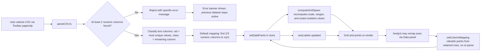
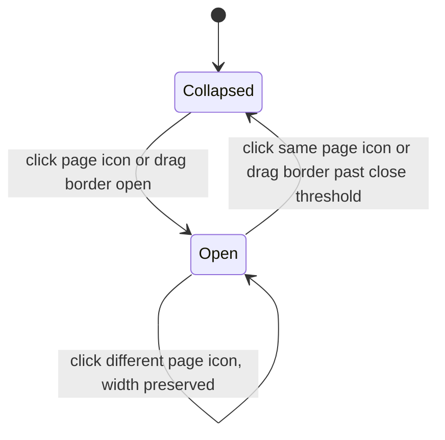
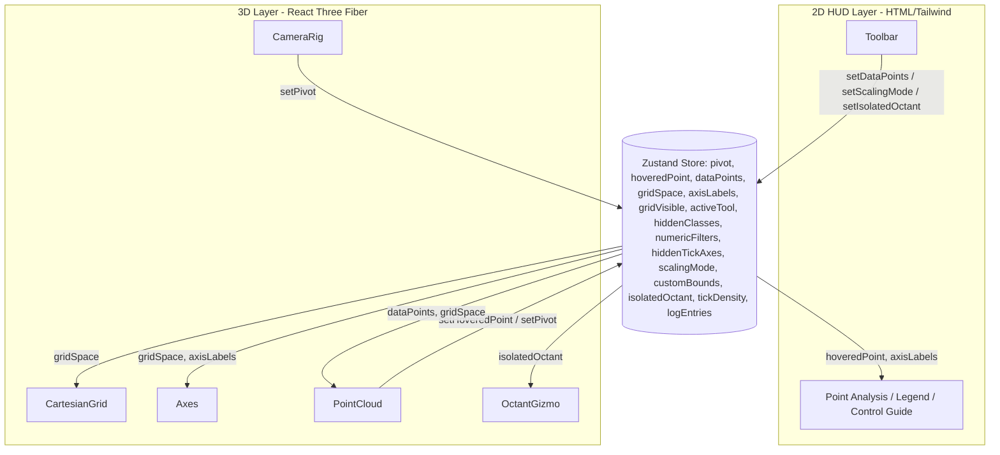

# Project Orinoco // 3D Cyber Threat Intelligence Visualizer

Project Orinoco is a browser-native 3D visualization tool for exploring network telemetry. It projects selected traffic features into a three-dimensional Cartesian space, allowing analysts to inspect individual observations, navigate spatial relationships, and investigate clusters interactively.

The application visualizes network flow features within a symmetric, signed 3D Cartesian coordinate system — every axis runs through the origin, so data-zero is always visible regardless of whether the loaded dataset is all-positive, all-negative, or mixed. Analysts can navigate the environment, inspect individual data points, isolate a spatial octant for focused analysis, and dynamically adjust their exploration viewpoint through an interactive pivot system. Camera movement is always relative to the active pivot. Any CSV matching the expected shape (at least two numeric columns, one or two text columns) can be loaded directly in-browser — the bundled sample dataset itself now loads through this same CSV pipeline, rather than a separate hardcoded data path.

---

# Preview

## Application Demo

**Demo Videos:**
[Watch Orinoco MVP Walkthrough 7/8/2026](https://youtu.be/Gr2Yjx_JF_4)
[Watch Orinoco MVP Walkthrough 7/20/2026](https://youtu.be/_KvzO14yMGE)
[Watch Orinoco Signed Grid & Octant Isolation Walkthrough](https://youtu.be/tIFLs0QYwfM)

Example walkthrough:

- Navigate the 3D environment using keyboard and mouse controls
- Hover over threat nodes to inspect metadata
- Select nodes to change the active pivot location
- Isolate a spatial octant to focus on one corner of the data
- Load a new CSV dataset directly from the toolbar, with the grid, axis labels, and points all updating to match

---

## Screenshots

> **Note:** the screenshots below predate the signed-grid/octant-isolation rework (PR #42) and are pending an update. See the demo videos above for the current UI in the meantime.

### Main Visualization View


_(placeholder — screenshot to be retaken)_

### Point Inspection HUD


_(placeholder — screenshot to be retaken)_

---

# Use Cases

Project Orinoco supports exploratory analysis when network behavior is easier to understand spatially than in a flat table or dashboard.

- **Investigate anomalous traffic** — Plot flow metrics such as packet rate, byte volume, and bytes per packet to find observations that sit far from normal traffic patterns.
- **Explore clusters and outliers** — Navigate dense groups in three dimensions, inspect individual points, and use the pivot system to examine local relationships from different viewpoints.
- **Compare traffic classes** — Color-coded classifications make it easier to see where normal and suspicious activity overlap, separate, or form distinct regions.
- **Focus on a region of interest** — Combine class filters, numeric range filters, and octant isolation to reduce visual noise and investigate a specific subset of the dataset.
- **Test feature combinations** — Load a CSV and remap numeric columns to the X, Y, and Z axes to evaluate which feature combinations reveal useful structure.
- **Communicate investigation findings** — Use the interactive scene as a shared visual reference when explaining an outlier, cluster, or traffic pattern to other analysts.

Project Orinoco is intended as an exploratory visualization aid. It complements—not replaces—detection rules, statistical analysis, and established incident-response workflows.

---

# Key Features

## Symmetric 3D Cartesian Plot Visualization

Project Orinoco renders high-dimensional network features in an interactive WebGL environment using Three.js and React Three Fiber.

Every axis is symmetric and signed — the display range for each axis is always `[-M, +M]`, where `M` is derived from the dataset's farthest value on that axis (plus a 10% margin, rounded outward). Data-zero therefore always sits at the exact center of the plotting volume, and both positive and negative values are visible regardless of the dataset's actual sign distribution. This replaces an earlier floor-anchored, open-face box design.

The reference frame is drawn in two parts:

- **`CartesianGrid.tsx`** — a single horizontal grid plane positioned at data-zero's render height (the box center for the full grid), plus a faint full 12-edge wireframe box outlining the plotting volume for depth reference
- **`Axes.tsx`** — the three bold coordinate axes, each running the full length of its axis through the origin with an arrowhead and a single column-name title at the positive end, plus adaptive tick marks

Each axis is independently scaled to the dataset's numeric range by default — tick labels always reflect real data-space values, and recompute automatically whenever a new dataset loads or the scaling mode changes (see **Scaling Modes** below).

Data dimensions (bundled sample dataset):

| Feature    | Axis |
| ---------- | ---- |
| invel_pps  | Y    |
| orig_bytes | X    |
| invel_bpp  | Z    |

A loaded CSV's own column names replace these automatically — see **Dynamic Dataset Loading** below.

---

## Dynamic Dataset Loading

Analysts can load any CSV dataset directly in-browser via the toolbar's file picker, rather than being limited to the bundled sample. The parser (`src/lib/parseCSV.ts`) auto-detects columns instead of assuming fixed names:

1. Each column is classified as **numeric** or **text** by sampling its values
2. With exactly 2 numeric columns, the dataset is treated as 2D (Z synthesized as 0). With 3 or more, the first three (in header order) become the default X/Y/Z — the analyst can override this afterward via the Data panel's Axis Mapping selectors, which apply instantly against the retained rows without re-parsing the file
3. Text columns are mapped to a unique identifier (`uid`) and a classification label (`class`) — the column with the highest ratio of unique values is treated as the identifier; any additional text columns are captured as point metadata, shown in the Point Analysis HUD
4. Malformed files (fewer than 2 numeric columns, no text columns, empty file) fail with a specific, visible error message rather than silently producing bad output or crashing
5. Rows with missing or invalid numeric values are skipped individually rather than failing the whole file — a banner reports which row numbers were excluded
6. Optionally, a second CSV can be loaded to override classification colors: a two-column file mapping class names to hex colors (e.g. `className,color`). Header names are matched flexibly (case-insensitive, ignoring spaces/underscores/hyphens), so `Class_Name` or `class name` are both accepted. Malformed rows (missing header, invalid hex value, empty class name) are skipped individually and reported in the Console, same as dataset CSV parsing — a color file doesn't have to be perfect to load the valid pairs it does contain

Once a file loads successfully, the grid's scale, the axis labels, the Point Analysis HUD panel's metric labels, and the rendered points all update together — nothing in the visualization stays hardcoded to any one dataset.

**No separate default-data code path:** the bundled sample (`sample-data/mixed-sign-sample.csv`, 500 rows straddling zero on all three axes) is imported as raw CSV text via Vite's `?raw` loader, wrapped in a `File`, and run through the exact same `parseCSV → setDataPoints` pipeline a user upload takes. The store starts with an empty dataset; `App.tsx` loads the sample on mount.


```mermaid
flowchart LR
    A[User selects CSV via Toolbar paperclip] --> B[parseCSV.ts]
    B --> C{At least 2 numeric columns found?}
    C -- No --> D[Reject with specific error message]
    D --> E[Error banner shown, previous dataset stays active]
    C -- Yes --> F[Classify text columns: uid = most unique values, class = remaining column]
    F --> G[Default mapping: first 2/3 numeric columns to x/y/z]
    G --> H[setDataPoints in store]
    H --> I[computeGridSpace recomputes scale, ranges, and octant isolation clears]
    H --> J[axisLabels updated]
    I --> K[Grid and points re-render]
    J --> K
    K --> L[Analyst may remap axes via Data panel]
    L --> M[setColumnMapping rebuilds points from retained rows, no re-parse]
    M --> H
```

**Known limitations (accepted for the current release):**

- Manual axis selection is only exposed once a dataset has more than 2 numeric columns — with exactly 2, there's nothing to choose between, so the selector is intentionally hidden to keep the interface minimal
- No manual override for which text column becomes `uid` vs. `class` — this is still auto-detected by uniqueness ratio

---

## Tactical Navigation

The visualization environment supports analyst-focused navigation. Keyboard behavior depends on whether the dataset has a Z axis mapped (3D mode) or not (2D mode, Z = None) — see 2D Mode below for why.

| Input         | 3D Mode                                                                                        | 2D Mode (Z = None)                   |
| ------------- | ---------------------------------------------------------------------------------------------- | ------------------------------------ |
| W             | Move toward current pivot                                                                      | Disabled                             |
| S             | Move away from current pivot                                                                   | Disabled                             |
| A             | Orbit left around pivot                                                                        | Disabled                             |
| D             | Orbit right around pivot                                                                       | Disabled                             |
| Left / Right  | Move pivot along the X axis                                                                    | Move pivot along the X axis          |
| Up / Down     | Move pivot along the Z axis                                                                    | Move pivot along the Y axis          |
| Space / Shift | Raise / lower pivot along the Y axis                                                           | Raise / lower pivot along the Y axis |
| Mouse Drag    | Free camera rotation, or pan (translate view), depending on the active tool set in the Toolbar | Pan only — rotation is locked        |
| Mouse Scroll  | Zoom                                                                                           | Zoom                                 |
| Mouse Hover   | Inspect point metadata                                                                         | Inspect point metadata               |
| Mouse Click   | Set selected node as new pivot                                                                 | Set selected node as new pivot       |
| Toolbar Reset | Return pivot to origin                                                                         | Return pivot to origin               |

### 2D Mode

When the active dataset has no Z column mapped (Z = None), the camera locks to a flat, top-down view looking straight down the Z axis at the X/Y plane — the plane the data is actually plotted on. This prevents the camera from tilting or orbiting to an angle where the flat dataset would appear as a sliver or disappear from view entirely.

- The camera snap preserves the current zoom distance rather than resetting to a default
- W/S (zoom-toward-pivot) and A/D (orbit) are disabled, along with mouse-drag rotation — orbit has no meaningful effect on a flat plane
- Up/Down, which drive Z traversal in 3D, are redirected to drive Y instead, since Z has no spatial role in 2D — this keeps all four arrow keys meaningful regardless of mode
- A passive "2D · Camera Locked" indicator appears near the Axis Mapping controls in the Toolbar's Data page, and the orbit/pan toolbar button's tooltip explains why orbit is unavailable
- Switching a Z column back in resumes normal 3D controls without forcing a re-snap

### Navigation Guardrails

- **Zoom limits** — a shared min/max camera-to-pivot distance (0.15 / 18 by default, configurable via `config.json`'s `camera` section), enforced both by OrbitControls' scroll dolly and the W/S keys, so the camera can neither pass through a point at close range in an unbounded way nor fly infinitely far out
- **Pivot bounds** — the pivot cannot be moved past a configurable multiple of the grid's half-extent beyond the walls (50% by default, `config.json`'s `camera.pivotLimitFactor`), clamped by a shared helper used by both arrow-key traversal and drag-panning, so rotation and the pivot marker stay in lockstep even when the clamp engages
- **Stuck-key protection** — OS screenshot shortcuts that don't deliver a `keyup` while a modifier key is held (e.g. macOS Cmd+Shift+4) are detected and clear all held movement keys, so the camera can't drift indefinitely from a "stuck" key
- **Tilt clamping** — in 3D mode, vertical orbit (tilt) stops just short of straight-up/straight-down rather than passing through, preventing gimbal-flip disorientation; horizontal orbit is unrestricted

---

## Dynamic Pivot System

Users can select any data node as an investigation reference point, or move the pivot directly with the arrow/space/shift keys.

When the pivot changes:

1. The global pivot coordinate updates in the shared store
2. The camera translates by the same offset that the pivot moved — rotation is preserved, so the new pivot lands at the same screen position the old one held rather than the camera whipping around to face it
3. The tactical reticle (a six-armed cross) tracks the new position
4. Analysts can explore nearby data relationships from the new vantage point

**Lockstep marker tracking:** the pivot marker is driven imperatively by `CameraRig.tsx`, in the same per-frame update as the camera itself, rather than being bound to React state. A state-driven marker lagged a frame behind the camera's own imperative movement, since store updates commit asynchronously relative to the render-frame loop — the imperative approach eliminates that lag entirely.

Isolating an octant (see below) also resets the pivot to the origin, since the old pivot was a coordinate in the pre-isolation mapping and no longer corresponds to the same data.

---

## Interactive Point Inspection

Interactive 3D events provide metadata inspection through the Heads-Up Display (HUD).

Displayed information includes:

- UID
- Classification
- XYZ coordinates
- Feature values, labeled with the active dataset's real column names

---

## SOC-Inspired Interface

The interface uses a security operations center inspired design with high-contrast visualization and a glass-morphism HUD.

Current classification visualization (bundled sample dataset):

| Data Value | Color     |
| ---------- | --------- |
| `normal`   | `#dddddd` |
| `nss`      | `#dd0000` |
| `qc`       | `#00dd00` |
| `zt`       | `#0000dd` |

A loaded CSV's own class values inherit these colors where names match, and fall back to a default color for any unrecognized class.

---

## Grid Display & Scaling

The Grid page in the Toolbar controls how the reference grid and axes are presented and scaled.

- **Show grid** — toggles the wireframe box and grid plane; axis lines, tick marks, and labels remain visible regardless, since coordinate reference stays useful even without the box geometry
- **Per-axis tick label visibility** — each of the three axes' tick marks and numeric labels can be hidden independently
- **Tick density** — a slider (3–30 by default, range and step configurable via `config.json`'s `limits.tickDensitySlider`) controlling how many tick marks appear per axis; the actual step size is rounded to a "nice" 1–2–5 number so labels stay human-readable. Tick marks and numbers scale per-frame by camera distance to hold a constant on-screen size rather than ballooning on approach
- **Scaling modes** — see below

### Scaling Modes

`computeGridSpace()` accepts a `ScalingConfig` that determines each axis's half-extent (`M`):

| Mode                          | Behavior                                                                                                                                                                                                                        |
| ----------------------------- | ------------------------------------------------------------------------------------------------------------------------------------------------------------------------------------------------------------------------------- |
| **Auto-normalized** (default) | Per-axis `M`, derived independently from each axis's own farthest value. Good for comparing shape when magnitudes differ wildly across axes.                                                                                    |
| **Auto-real scale**           | One shared `M`, derived from the single farthest value across all axes — a unit of data renders as the same length on every axis (true relative distances). Small-range axes bunch near the origin rather than filling the box. |
| **Custom**                    | A typed ± bound per axis; any axis left blank or invalid falls back to its auto-normalized value.                                                                                                                               |

Mode and bound changes recompute the grid live.

---

## Octant Isolation

The Isolate page in the Toolbar lets an analyst focus on one spatial corner (octant) of the data.

A small 3D gizmo (`OctantGizmo.tsx`) — eight cubes in a wireframe outline — mirrors the main view's rotation in lockstep, so whichever cube occupies a given on-screen position is the octant currently facing the camera there.

| Action                                    | Result                                                                         |
| ----------------------------------------- | ------------------------------------------------------------------------------ |
| Click a cube                              | That octant enlarges to fill the entire grid; all points outside it are hidden |
| Click the same cube again                 | Reverts to the full grid (toggle)                                              |
| Click inside the outline but off any cube | Reverts to the full grid                                                       |
| Click Reset                               | Reverts to the full grid                                                       |

**Implementation:** isolation is expressed purely as a change to each axis's display range — the selected octant's sides become one-sided (`[0, M]` or `[-M, 0]`) instead of the full `[-M, M]`. Since that range still maps onto the same fixed render box, the octant enlarges automatically and everything downstream follows for free: points reposition, tick numbers rescale and refine, and the axes reposition so data-zero sits at a box corner instead of the center. Points exactly at `0` on an isolated axis are assigned to the positive side, so the eight octants partition the dataset cleanly with no point counted twice.

**Transition:** because both the pre- and post-isolation mappings are the same affine transform (`(value − CENTER) × SCALE`), `IsolationTransition.tsx` re-renders children into the new mapping immediately, applies a compensating transform that puts everything back where it visually was, then eases that transform to identity over 450ms — a real zoom effect using one group scale/position per frame, with no instance-buffer re-upload, so it stays cheap at scale. The transition deliberately only animates octant changes; a new CSV load can rescale by orders of magnitude and would otherwise swoop unpredictably.

**Camera sync:** the gizmo reads a plain mutable quaternion (`lib/cameraSync.ts`), written by `CameraRig` every frame — deliberately not routed through the Zustand store, since a per-frame store write would re-render every store subscriber 60 times a second.

Isolation clears automatically whenever a new CSV loads, since an octant chosen against the old dataset says nothing about the new one.

---

## Toolbar

A Blender-style docked side panel provides quick access to data and display controls, without needing to memorize keyboard shortcuts for everything.

**Layout:** an icon strip sits fixed between the 3D viewport and a resizable content pane, both docked to the screen's right edge. Dragging the border on the icon strip's viewport-facing side resizes the content pane open or shut — matching the interaction pattern of Blender's Properties editor.

**Icon strip contents:**

| Icon           | Action                                                                                                                     |
| -------------- | -------------------------------------------------------------------------------------------------------------------------- |
| Paperclip      | Opens the native file picker to load a CSV                                                                                 |
| Reset          | Returns the pivot to the origin                                                                                            |
| Hand / Pointer | Switches the mouse-drag behavior between orbit (rotate around pivot) and pan (translate view)                              |
| Data           | Opens a panel for class-visibility filtering, per-axis numeric filters, and point-size scaling                             |
| Grid           | Opens a panel for grid visibility, tick labels, tick density, and scaling mode selection                                   |
| Box            | Opens the Isolate page (octant gizmo) — lights up while an octant is isolated                                              |
| Terminal       | Opens the Console page (session diagnostics) — lights up with an unreviewed-issue badge when an error or warning is logged |

Grid visibility was moved from a standalone icon-strip toggle into the Grid page itself, consolidating display settings into one place.


```mermaid
stateDiagram-v2
    [*] --> Collapsed
    Collapsed --> Open: click page icon or drag border open
    Open --> Collapsed: click same page icon or drag border past close threshold
    Open --> Open: click different page icon, width preserved
```

---

## Data Filtering & Point Sizing

The Data page in the Toolbar supports narrowing down the visible point cloud:

- **Class visibility filtering** — individual classification categories can be hidden from the render, each shown with its assigned color swatch
- **Per-axis numeric filters** — points can be filtered by value range on any of the three axes, using an operator dropdown (>, ≥, <, ≤, =, between) plus one or two value boxes
- **Point-size scaling** — point size adjusts automatically based on dataset density (denser datasets get smaller points so they don't merge into a blob), with a manual multiplier slider (range configurable via `config.json`'s `limits.pointSizeSlider`) and one-click reset to the automatic size

Rendering is done as a single instanced mesh, so filtering by class, numeric range, or octant isolation doesn't remount or reallocate anything — hidden points are simply excluded from the draw call.

---

## Diagnostics Console

The Console page in the Toolbar (Terminal icon) shows a running log of every diagnostic raised during the session — dataset loads, color-file loads, remapped axes, and any errors or warnings along the way.

Each entry carries a stable, versioned code (e.g. `CSV-002`, `CLR-001`) rather than a free-text message alone, so a specific failure can be referenced consistently regardless of how its wording changes over time. Entries are grouped by severity:

| Severity | Meaning                                                                                    |
| -------- | ------------------------------------------------------------------------------------------ |
| Error    | The operation failed outright (e.g. a CSV with too few numeric columns)                    |
| Warning  | The operation succeeded, but some rows were excluded (e.g. a few rows with missing values) |
| Info     | The operation succeeded cleanly (e.g. a dataset loaded, or axes were remapped)             |

- The icon-strip Terminal button shows an unreviewed-issue badge (error/warning count) when the Console hasn't been opened since the last problem was logged; opening the page clears it
- Each entry can be expanded to show per-row detail — for large exclusion lists, this switches from listing every row to a per-cause summary (e.g. "12 rows: class is empty") so one bad column in a huge file doesn't flood the log
- The log is capped at a configurable number of entries per session (oldest dropped first) and can be cleared manually
- Color-file overrides are validated against the currently loaded dataset's actual classes: an override whose class name doesn't match anything in the dataset is flagged as a warning rather than applying silently

---

# Architecture

Project Orinoco separates rendering, application state, and interface responsibilities.

## Design Philosophy

Project Orinoco follows a separation-of-concerns architecture:

- React manages application structure and UI
- React Three Fiber manages 3D visualization
- Zustand manages shared interaction state, including the active dataset
- Data sources remain independent from rendering logic — any dataset matching the expected shape can be loaded without touching rendering components

This architecture allows the visualization engine to evolve as new threat datasets become available.


```mermaid
flowchart TB
    subgraph UI["2D HUD Layer - HTML/Tailwind"]
        Toolbar
        HUD["Point Analysis / Legend / Control Guide"]
    end
    subgraph R3F["3D Layer - React Three Fiber"]
        CartesianGrid
        Axes
        PointCloud
        OctantGizmo
        CameraRig
    end
    Store[("Zustand Store: pivot, hoveredPoint, dataPoints, gridSpace, axisLabels, gridVisible, activeTool, hiddenClasses, numericFilters, hiddenTickAxes, scalingMode, customBounds, isolatedOctant, tickDensity, logEntries")]
    Toolbar -- "setDataPoints / setScalingMode / setIsolatedOctant" --> Store
    PointCloud -- "setHoveredPoint / setPivot" --> Store
    CameraRig -- "setPivot" --> Store
    Store -- "dataPoints, gridSpace" --> PointCloud
    Store -- "gridSpace, axisLabels" --> Axes
    Store -- "gridSpace" --> CartesianGrid
    Store -- "isolatedOctant" --> OctantGizmo
    Store -- "hoveredPoint, axisLabels" --> HUD
```

### Two-layer rendering model

The application renders two separate layers stacked on top of each other: a flat 2D HTML/Tailwind layer (branding, HUD panels, legends, the toolbar) and a 3D `<Canvas>` layer beneath it (the navigable scene). These are two independent React trees — the HTML layer isn't a child of the Canvas, and neither has a direct reference to the other.

The 2D layer uses `pointer-events-none` so mouse clicks pass through it into the 3D scene, except where a specific HUD element (like the toolbar) opts back in. Because the two trees can't pass props to each other directly, they communicate exclusively through the shared Zustand store: a pointer event inside the Canvas (e.g. hovering a data point in `PointCloud.tsx`) updates the store, and the HTML layer (in `App.tsx`) reacts to that same store value to update the HUD — with neither component needing to know the other exists.

**Note on the toolbar's z-index:** React Three Fiber's `<Canvas>` wrapper renders after the HUD overlay in the DOM and establishes its own stacking context. Without an explicit `z-index` on the toolbar, the Canvas visually paints on top of it despite looking identical to the background — silently intercepting clicks meant for the toolbar. The toolbar is deliberately given a higher `z-index` than the HUD overlay to prevent this.

### Why Zustand for shared state

Given the two-layer model above, some mechanism is needed to synchronize state between the 3D scene and the 2D HUD. Zustand was chosen over React Context or Redux for a few reasons:

- No `<Provider>` wrapper required — any component calls the `useStore` hook directly
- Components subscribe to only the specific state slice they need (e.g. `state => state.pivot`), so a change to one field doesn't cause unrelated components to re-render
- Minimal boilerplate compared to Redux's actions/reducers/dispatch pattern, appropriate for the amount of shared state this application needs

**Exceptions to the store-driven pattern:** the pivot cross marker is driven imperatively by `CameraRig.tsx` via a ref, not by reading `pivot` from the store (see **Dynamic Pivot System** above). Similarly, the Isolate gizmo's camera-mirroring reads a plain mutable quaternion written every frame by `CameraRig` (`lib/cameraSync.ts`), deliberately outside Zustand, since a per-frame store write would re-render every subscriber 60 times a second.

### Why symmetric, signed grid ranges

Earlier, `computeGridSpace()` anchored each axis at its data minimum, adding a center reference line only for datasets that introduced negative values. The current model instead always returns a symmetric `[-M, +M]` range per axis, where `M` is derived from the farthest value on that axis (plus a margin, rounded outward) — so data-zero always sits at a known, consistent position (the box center for the full grid, a box edge or corner when an octant is isolated), regardless of the dataset's actual sign distribution. This removed the need for a separate "center axis" toggle and a "zero plane" mode switch — the zero-crossing reference is simply always drawn.

### Why a custom Cartesian grid instead of a built-in helper

`@react-three/drei` ships a generic `Grid` helper — a flat, infinite floor-plane grid intended for general 3D scene reference (e.g. a game editor's floor). It doesn't support bounded dimensions, per-axis symmetric ranges, octant-based partial ranges, or tick marks/axis labels tied to specific data ranges. `CartesianGrid.tsx` and `Axes.tsx` were built as custom components instead, giving full control over the plane position, wireframe box, and tick/label placement.

### Dynamic per-axis scaling

Each axis's display range is computed by `computeGridSpace()` in `src/lib/gridSpace.ts`, a pure function re-run whenever the active dataset, scaling mode, custom bounds, or isolated octant changes (see `useStore.ts`'s `gridSpaceFor()` helper, which centralizes every input this computation depends on so no dependency can be silently missed). `gridSpace.ts`'s output — `DISPLAY_RANGE`, `SCALE`, `CENTER`, `ZERO_RENDER`, and `toRenderSpace` — is the single source of truth shared by `CartesianGrid.tsx` (box/plane geometry), `Axes.tsx` (ticks/labels), and `PointCloud.tsx` (point positioning and octant filtering via `inOctant()`), so the three can never drift out of sync with each other.

---

## Application Structure

```text
orinoco/
├── docs/
│   ├── images/
│   │   ├── main.png
│   │   └── data_info.png
│   └── video/
│       └── orinoco-demo.mp4
│
├── test-data/
│   ├── test-1k.csv
│   │   └── Synthetic 1,000-row dataset for load/render testing
│   ├── test-10k.csv
│   │   └── Synthetic 10,000-row dataset for performance testing
│   └── test-malformed.csv
│       └── Deliberately invalid CSV (wrong column count) for
│           exercising parseCSV.ts's error handling
│
├── sample-data/
│   └── mixed-sign-sample.csv
│       └── 500-row mixed positive/negative sample — now the
│           bundled default dataset, loaded via the CSV pipeline
│
├── src/
│   ├── components/
│   │   ├── Axes.tsx
│   │   │   └── Bold coordinate axes through the origin, tick
│   │   │       marks/labels, and axis titles
│   │   │
│   │   ├── CartesianGrid.tsx
│   │   │   └── Horizontal grid plane at data-zero + full
│   │   │       12-edge wireframe box
│   │   │
│   │   ├── CameraRig.tsx
│   │   │   └── WASD + arrow/space/shift navigation, drag-panning,
│   │   │       zoom/pivot guardrails, and imperative per-frame
│   │   │       tracking of the pivot marker and camera-sync quaternion
│   │   │
│   │   ├── OctantGizmo.tsx
│   │   │   └── The Isolate page's rotating cube-of-cubes control
│   │   │
│   │   ├── IsolationTransition.tsx
│   │   │   └── Animates the affine transform between full-grid and
│   │   │       isolated-octant mappings
│   │   │
│   │   ├── PointCloud.tsx
│   │   │   └── Threat data rendering and interaction — reads the
│   │   │       active dataset and grid geometry from the store
│   │   │
│   │   └── Toolbar.tsx
│   │       └── Docked, resizable side panel: CSV loader, origin
│   │           reset, Data/Grid/Isolate/Console pages
│   │
│   ├── lib/
│   │   ├── gridSpace.ts
│   │   │   └── computeGridSpace() — derives symmetric plotting
│   │   │       bounds, scaling, and octant-isolated ranges
│   │   ├── cameraSync.ts
│   │   │   └── Mutable camera-orientation quaternion shared between
│   │   │       CameraRig and OctantGizmo, outside the store
│   │   ├── classColors.ts
│   │   │   └── Single source of truth for classification → color mapping
│   │   ├── config.ts
│   │   │   └── Typed loader + validator for config.json — the single
│   │   │       place deployment-level values are read from
│   │   ├── errorCodes.ts
│   │   │   └── Registry of every diagnostic code (CSV-xxx, CLR-xxx)
│   │   │       plus the AppError helpers that carry one into the UI
│   │   ├── parseCSV.ts
│   │   │   └── Auto-detecting CSV parser — classifies columns,
│   │   │       maps them to X/Y/Z/uid/class, validates and reports errors
│   │   └── parseColorsCSV.ts
│   │   ├── parseColorsCSV.ts
│   │   │   └── Parses a colors.csv override file, mapping class names
│   │   │       to hex colors with flexible header matching
│   │   ├── colorValidation.ts
│   │   │   └── Cross-checks color overrides against the loaded
│   │   │       dataset's actual classes; flags unmatched overrides
│   │   └── truncateLabel.ts
│   │       └── 8-character display truncation for long axis/class
│   │           names, with separator-aware splitting
│   │
│   ├── store/
│   │   └── useStore.ts
│   │       └── Global visualization state: pivot, hoveredPoint,
│   │           hoveredAxis, dataPoints, gridSpace, axisLabels,
│   │           gridVisible, activeTool, hiddenClasses, numericFilters,
│   │           hiddenTickAxes, scalingMode, customBounds,
│   │           isolatedOctant, tickDensity, logEntries,
│   │           classColorOverrides
│   │
│   ├── types.ts
│   │   └── Shared DataPoint interface, used by the store, parser,
│   │       and grid math so the shape is defined exactly once
│   │
│   ├── App.tsx
│   │   └── Application shell, Canvas, HUD, CSV-load orchestration,
│   │       and mount-time loading of the bundled sample via the
│   │       CSV pipeline
│   │
│   ├── main.tsx
│   │   └── React entry point
│   │
│   ├── vite-env.d.ts
│   │   └── Type declarations enabling the `?raw` CSV import
│   │
│   └── index.css
│       └── Tailwind CSS configuration
│
├── vite.config.ts
└── package.json
```

---

# Interaction Flow

The application follows this interaction model:

```text
User Interaction
        |
        ↓
React Three Fiber Events
        |
        ↓
Zustand Global State
        |
        ↓
HUD Updates
```

Example — hovering a point:

1. User hovers over a threat node
2. R3F pointer event captures the interaction
3. Metadata updates the Zustand store
4. The HUD displays point information

Example — loading a CSV:

1. User clicks the toolbar's paperclip icon and selects a file
2. `parseCSV.ts` classifies columns and validates the shape
3. On success, `setDataPoints` replaces the dataset, clears any isolated octant, and recomputes grid geometry and axis labels atomically
4. The grid, axis labels, HUD panel, and rendered points all update to reflect the new dataset

Example — isolating an octant:

1. User clicks a cube on the Isolate page's gizmo
2. `setIsolatedOctant` recomputes `gridSpace` with that octant's one-sided ranges and resets the pivot to the origin
3. `IsolationTransition` animates the affine remap over 450ms
4. Points outside the octant are filtered from the render via `inOctant()`; ticks and axes rescale to the narrower range

---

# Tech Stack

## Framework & Build

### React 19 + TypeScript

Used for:

- Component architecture
- Type-safe application development
- UI state management

### Vite

Used for:

- Fast development workflow
- Optimized production builds
- Raw-text CSV import (`?raw`) for the bundled sample dataset

---

## 3D Visualization

### Three.js

WebGL-based 3D rendering engine.

### React Three Fiber (R3F)

Provides a React-based interface for managing Three.js scenes.

Used features:

- `<Canvas />` rendering environment
- `useFrame` animation loop
- Pointer interaction events
- 3D object components
- Scene and camera integration
- Instanced rendering (`InstancedMesh`) for the point cloud, scaling to 100k+ points as a single draw call
- Imperative refs (`pivotMarkerRef`) for per-frame object updates outside the store-driven pattern

### @react-three/drei

Provides reusable Three.js helpers:

- OrbitControls
- Billboard labels
- Text components

---

## State Management

### Zustand

Used for low-latency synchronization between:

- 3D interaction events
- Camera pivot state
- The active dataset and its derived grid geometry
- HUD metadata

Managed state:

- Current pivot coordinates
- Hovered point information
- Active dataset (`dataPoints`)
- Derived grid geometry for the active dataset (`gridSpace`)
- Axis labels for the active dataset (`axisLabels`)
- Grid visibility (`gridVisible`)
- Active navigation tool — orbit or pan (`activeTool`)
- Distinct class names present in the active dataset (`availableClasses`)
- Class visibility and per-axis numeric filters (`hiddenClasses`, `numericFilters`)
- Per-axis tick label visibility (`hiddenTickAxes`)
- Active axis-scaling mode and custom bounds (`scalingMode`, `customBounds`)
- Currently isolated octant, if any (`isolatedOctant`)
- Tick-density target (`tickDensity`)
- Session diagnostics log — every error/warning/info raised this session (`logEntries`)

---

## Data Parsing

### PapaParse

CSV parsing library used by `parseCSV.ts` to read uploaded files. Paired with `@types/papaparse` for TypeScript type coverage, since the library doesn't ship its own type declarations.

---

## Styling & Tooling

### Tailwind CSS v4

Used for:

- HUD overlays
- Toolbar and panel styling
- Interface components
- Responsive styling

### OxLint

Rust-based linter used for:

- Fast code analysis
- Correctness checks
- Development consistency

The project runs OxLint through the configured npm lint script:

```bash
npm run lint
```

### Lucide React

Icon library used for interface elements, including the toolbar's icon strip (paperclip, reset, pan/orbit toggle, Data/Grid/Isolate/Console page icons).

---

# Data Configuration

The application no longer bundles a static `data.json`. The default dataset (`sample-data/mixed-sign-sample.csv`, 500 rows with values straddling zero on all three axes) loads on mount through the same `parseCSV → setDataPoints` pipeline a user's own CSV upload takes — there is no separate hardcoded-data code path.

Loaded datasets, whether the bundled sample or a user CSV, share the same internal shape:

```json
{
  "uid": "C7mJzI2kJo1VmffDG6",
  "x": 13816,
  "y": 0.02753,
  "z": 84.084211,
  "className": "normal"
}
```

Column-to-axis mapping is produced by `parseCSV.ts`'s auto-detection — see **Dynamic Dataset Loading**.

Current visualization categories (bundled sample dataset):

| Data Value | Color     |
| ---------- | --------- |
| `normal`   | `#dddddd` |
| `nss`      | `#dd0000` |
| `qc`       | `#00dd00` |
| `zt`       | `#0000dd` |

Classification colors are defined in `src/lib/classColors.ts`, shared by both the point cloud rendering and the HUD legend so they can't drift out of sync. Any class value not present in this mapping (e.g. from a loaded CSV with new categories) falls back to a default color rather than failing.

---

# Deployment Configuration

Most values that would otherwise be hardcoded — grid dimensions, point sizing, camera speeds and zoom limits, startup defaults, slider ranges, accepted CSV/color-file header names, and diagnostics log limits — live in a single `config.json` at the project root instead of scattered across component files.

- Vite inlines `config.json` at build time, so changes require a dev-server restart or rebuild to take effect
- The config's shape is validated at module load — a value that's the right type but a nonsensical setting (e.g. an inverted zoom range, a negative point count) throws a clear error immediately rather than surfacing later as a subtle rendering bug
- This is aimed at deployment-time tuning, not runtime user preference — the Toolbar's own sliders (point size, tick density) still control per-session values within whatever range `config.json` allows

---

# Installation & Setup

## Prerequisites

| Tool    | Version                          | Notes                                                                          |
| ------- | -------------------------------- | ------------------------------------------------------------------------------ |
| Node.js | v22.12.0 or newer (v24.x tested) | Required by `@react-three/drei`'s `camera-controls` dependency; see note below |
| npm     | v10 or newer (bundled with Node) | Verify with `npm -v`                                                           |
| Git     | any recent version               | Required to clone the repo                                                     |

This project was developed and tested with **Node v24.13.1** and **npm 11.10.0**.

### Installing Node.js

- **Windows**: [Official installer](https://nodejs.org/) or [nvm-windows](https://github.com/coreybutler/nvm-windows)
- **macOS**: [nvm](https://github.com/nvm-sh/nvm) (`brew install nvm`) or Homebrew (`brew install node`)
- **Linux**: [nvm](https://github.com/nvm-sh/nvm) or your distro's package manager

After installing, confirm your versions match the table above:

```bash
node -v
npm -v
```

## Clone Repository

The following commands are identical across PowerShell, Command Prompt, WSL/Git Bash, and macOS/Linux terminals.

```bash
git clone https://github.com/cwheelus/orinoco.git
cd orinoco
```

## Install Dependencies

```bash
npm install
```

## Start Development Server

```bash
npm run dev
```

By default this serves the app at [http://localhost:5173](http://localhost:5173) (Vite's default dev port). On load, the app boots directly into the bundled mixed-sign sample dataset.

## Build for Production

```bash
npm run build
```

## Run Linter

```bash
npm run lint
```

## Run Tests

```bash
npm test
```

Runs the automated Vitest suite (70 tests covering CSV/color-file parsing, filters, and truncation logic). See [TESTING_GUIDE.md](TESTING_GUIDE.md) for setup notes, testing conventions, and a full breakdown of what is and isn't covered.

## Test Data

Sample CSV files for manually exercising the loader live in `test-data/`:

| File                 | Purpose                                                                                                                                 |
| -------------------- | --------------------------------------------------------------------------------------------------------------------------------------- |
| `test-1k.csv`        | 1,000-row synthetic dataset, for confirming normal load/render behavior at moderate scale                                               |
| `test-10k.csv`       | 10,000-row synthetic dataset, for performance testing                                                                                   |
| `test-malformed.csv` | Deliberately invalid (wrong column count), for confirming `parseCSV.ts`'s error handling surfaces correctly instead of failing silently |

The bundled default dataset lives in `sample-data/`:

| File                    | Purpose                                                                                                     |
| ----------------------- | ----------------------------------------------------------------------------------------------------------- |
| `mixed-sign-sample.csv` | 500-row sample with both positive and negative values on all three axes — loaded automatically on app start |

Load any of the `test-data/` files through the toolbar's paperclip icon to try a different dataset.

## Key Dependency Versions

Pulled directly from [package.json](package.json)

| Package                | Version  |
| ---------------------- | -------- |
| react / react-dom      | ^19.2.7  |
| typescript             | ~6.0.2   |
| vite                   | ^8.1.1   |
| three                  | ^0.185.1 |
| @react-three/fiber     | ^9.6.1   |
| @react-three/drei      | ^10.7.7  |
| zustand                | ^5.0.14  |
| tailwindcss            | ^4.3.2   |
| papaparse              | ^5.5.4   |
| @types/papaparse (dev) | ^5.5.2   |
| lucide-react           | ^1.25.0  |
| oxlint (dev)           | ^1.71.0  |
| vitest (dev)           | ^4.1.10  |

---

# Future Enhancements

See the [Issues tab](https://github.com/cwheelus/orinoco/issues) for planned work and open feature requests.

- **Retake README screenshots** — the Screenshots section still shows placeholders (`main.png`, `data_info.png`) predating the signed-grid/octant-isolation rework (#42). Needs fresh captures of the main visualization view and the Point Analysis HUD, ideally also covering newer UI (2D camera lock, Diagnostics Console) not shown in any current screenshot.

---

# Current Development Status

Project Orinoco is a functional MVP demonstrating:

- Interactive 3D threat visualization with a symmetric, signed Cartesian grid
- Octant isolation with a camera-synced gizmo and animated transitions
- Three axis-scaling modes: auto-normalized, auto-real-scale, and custom bounds
- WASD camera navigation with dedicated arrow/space/shift pivot traversal, plus orbit and pan drag modes
- Navigation guardrails: zoom limits, pivot bounds, and stuck-key protection
- Dynamic pivot exploration with origin reset and lockstep marker tracking
- CSV-only dataset loading (no separate hardcoded default), with an auto-detecting parser and clear error handling for malformed or partially invalid files, plus an optional colors.csv override for classification colors
- A locked, flat top-down camera mode for 2D (Z-less) datasets, with orbit/tilt disabled and full arrow-key panning preserved
- A session diagnostics Console with stable, coded error/warning/info entries and per-row detail
- Deployment-level tuning via a validated `config.json` (grid, points, camera, defaults, sliders)
- A docked, resizable toolbar for data loading, pivot reset, dataset filtering, and grid/scaling/isolation controls
- Instanced point rendering with count-adaptive sizing for large datasets
- Real-time metadata inspection, labeled with the active dataset's real column names
- SOC-style analyst interface
- An automated Vitest regression suite (70 tests) covering CSV/color-file parsing, numeric filters, and display truncation — see [TESTING_GUIDE.md](TESTING_GUIDE.md)

---

# Project Team

©2026 Sentient Solutions

Developers:

- Mark Yosinao
- Daniel Merced

Advisors:

- Eric Lloyd
- BC Ko

Stakeholder:

- Charles Wheelus, Founder
  Sentient.solutions
